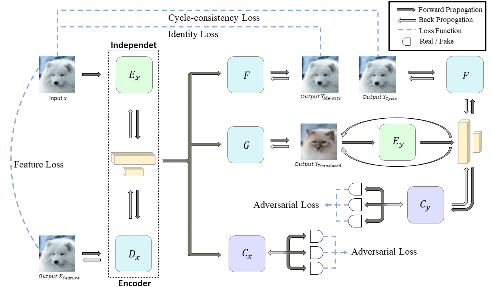
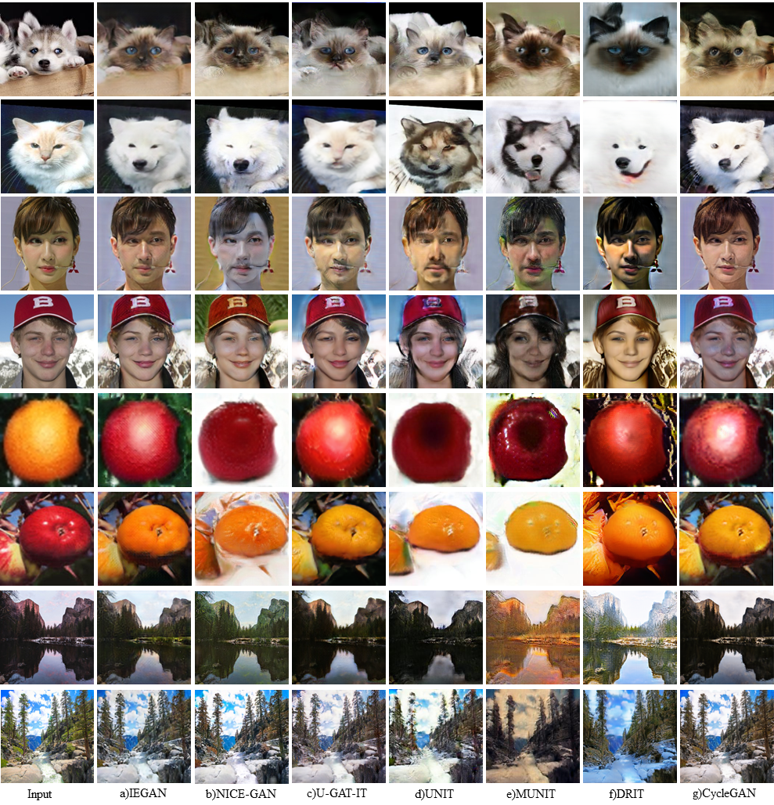

## IEGAN &mdash; Official PyTorch Implementation
### Independent Encoder for Deep Hierarchical Unsupervised Image-to-Image Translation [[Paper]](https://arxiv.org/abs/2107.02494)

<div align="center">
  
</div>

> **Independent Encoder for Deep Hierarchical Unsupervised Image-to-Image Translation**<br>
>
> **Abstract** *The main challenges of image-to-image translation are to make the translated image realistic and retain as much information from the source domain as possible. To address this issue, we propose a novel architecture, termed as IEGAN, which removes the encoder of each network and introduces an encoder that is independent of other networks. Compared with previous models, it embodies three advantages of our model: Firstly, it is more directly and comprehensively to grasp image information since the encoder no longer receives loss from generator and discriminator. Secondly, the independent encoder allows each network to focus more on its own goal which makes the translated image more realistic. Thirdly, the reduction in the number of encoders performs more unified image representation. However, when the independent encoder applies two down-sampling blocks, it's hard to extract semantic information. To tackle this problem, we propose deep and shallow information space containing characteristic and semantic information, which can guide the model to translate high-quality images under the task with significant shape or texture change. We compare IEGAN with other previous models, and conduct researches on semantic information consistency and component ablation at the same time. These experiments show the superiority and effectiveness of our architecture.*

## Author
Kai Ye, Yinru Ye, Minqiang Yang, Bin Hu
[[Ubiquitous Awareness and Intelligent Solutions Lab]](https://uais.lzu.edu.cn)

## Usage
```
├── dataset
   └── YOUR_DATASET_NAME
       ├── trainA
           ├── xxx.jpg (name, format doesn't matter)
           ├── yyy.png
           └── ...
       ├── trainB
           ├── zzz.jpg
           ├── www.png
           └── ...
       ├── testA
           ├── aaa.jpg 
           ├── bbb.png
           └── ...
       └── testB
           ├── ccc.jpg 
           ├── ddd.png
           └── ...
```

### Prerequisites
* Python 3.6.13
* Pytorch 1.2.0 and torchvision 0.4.0 (https://pytorch.org/)
* linear_attention_transformer
* CUDA 10.0.130, CuDNN 7.6, and CentOS 7.8.

### GPU memory occupied size

* In the actual situation of using Tesla P100, IEGAN will occupy `9709`MiB

### Train
```
> CUDA_VISIBLE_DEVICES=X python3 main.py --dataset=cat2dog
```
* **X** choose the GPU to use

### Restoring from the previous checkpoint
```
> CUDA_VISIBLE_DEVICES=X python3 main.py --dataset cat2dog --resume True
```
* Previous checkpoint:  **dataset**_params_latest.pt

* Trained models():
Our previous checkpoint on cat2dog can be downloaded from https://pan.baidu.com/s/1IlTCVg5DC2klR4mRTo-mCw Extraction code: yeyr.

### Test
```
> python3 main.py --dataset cat2dog --phase test
```

### Metric
```
> CUDA_VISIBLE_DEVICES=X python3 fid_kid.py testA fakeA --mmd-var 
```
* You can use gpu, set `X` to **the index of gpu**, such as `CUDA_VISIBLE_DEVICES=0`

## Network
<div align="center">
  
</div>

## Comparison
<div align="center">
  
</div>

## Acknowledgments
Our code is inspired by [NICE-GAN-pytorch](https://github.com/alpc91/NICE-GAN-pytorch).
